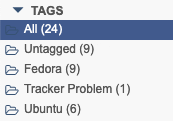

qBittorrent Tracker Hound
=========================

Maintains a tag on torrents with broken trackers.

qBittorrent has no mechanism to show which torrents have broken trackers.
This tool will check each torrent and add/remove a tag to help you identify these torrents.



This tool is provided as a Docker container which runs as a cron job.

[][hub]
[][layers]

 [hub]: https://hub.docker.com/r/jakewharton/qbt-tracker-hound/
 [layers]: https://microbadger.com/images/jakewharton/qbt-tracker-hound


Usage
-----

The container connects to qBittorrent over its API which is exposed the same way as its web interface.
You will need a valid username and password.
The default username is 'admin', and the default password is 'adminadmin' which reflect the qBittorrent defaults.

There are three general ways to connect:

 1. Use the qBittorrent container as the network for this container.
 2. Use the qBittorrent container hostname.
 3. Use an explicit hostname/IP that resolves to the container.

Option 2 and option 3 are really the same thing and are the recommended path.

For option 2, ensure your qBittorrent container has a hostname defined.
For `docker run` this means specifying `--hostname qbittorrent`.
For Docker Compose use the `hostname` key in the service definition:
```yaml
services:
  qbittorrent:
    image: linuxserver/qbittorrent
    hostname: qbittorrent
    # …
```

Start this container and point it at your qBittorrent instance with the `QBT_HOST` environment variable.

```
$ docker run -d \
    -e "QBT_HOST=http://qbittorrent:8080" \
    jakewharton/qbt-tracker-hound:trunk
```

For Docker Compose, add it as an additional service:
```yaml
services:
  qbt-tracker-hound:
    container_name: qbt-tracker-hound
    image: jakewharton/qbt-tracker-hound:trunk
    restart: unless-stopped
    environment:
      - "QBT_HOST=http://qbittorrent:8080"
```

If you have a non-default username or password, specify the `QBT_USER` and/or `QBT_PASS` environment variables, respectively.

The container will check all of your torrents every 5 minutes by default.
To change when it runs, specify the `CRON` environment variable with a valid cron specifier.
For help creating a valid cron specifier, visit [cron.help][cron].

 [cron]: https://cron.help/#*/5_*_*_*_*

The 'Tracker Problem' tag will be used by default.
To change it, specify your desired tag name in the `QBT_TAG` environment variable.


LICENSE
======

MIT. See `LICENSE.txt`.

    Copyright 2020 Jake Wharton
